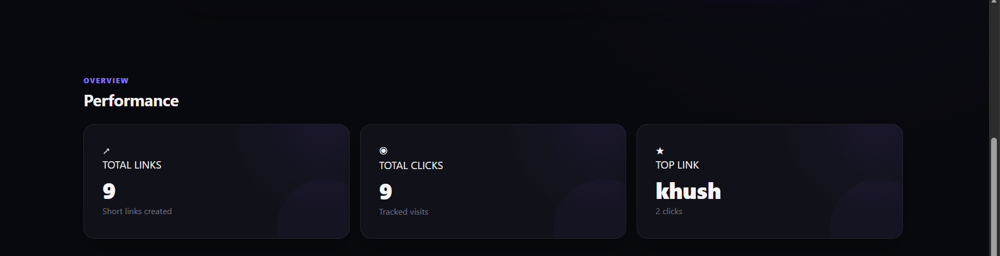
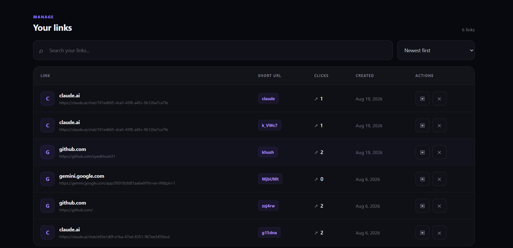

# 🔗 URL Shortener & Analytics Dashboard

A full-stack URL shortening application that lets users create short URLs, use custom aliases, track click counts, and manage links through a modern analytics dashboard.

Built with **React, Node.js, Express.js, and MySQL**.

---

## 🚀 Overview

The application provides a simple interface for creating and managing shortened URLs.

Users can:

- Create short URLs from long URLs
- Generate random short codes
- Create custom aliases such as `/github` or `/portfolio`
- Redirect users through shortened URLs
- Track click counts
- Identify the most-clicked link
- Search and sort saved links
- Copy short URLs to the clipboard
- Delete shortened URLs
- Automatically refresh dashboard data when returning to the application

The project follows a modular full-stack architecture with a React frontend, Express/Node.js backend, REST APIs, and a MySQL database.

---

## ✨ Features

### URL Shortening

- Generate short codes using `nanoid`
- Create custom aliases
- Validate submitted URLs
- Validate custom alias format
- Enforce custom alias length limits
- Prevent duplicate aliases and short codes
- Handle extremely unlikely short-code collisions
- Redirect short URLs to their original destinations

### Analytics

- Total number of shortened URLs
- Total click count
- Most-clicked link
- Individual click counts for each shortened URL
- Dashboard statistics
- Automatic data refresh when returning to the application

### Link Management

- Search links by original URL
- Search links by short code
- Sort by newest
- Sort by oldest
- Sort by number of clicks
- Copy short URLs to clipboard
- Delete shortened URLs
- Display creation date
- Display click counts

### User Experience

- Modern dark-themed interface
- Responsive layout
- Loading states
- Empty states
- Toast notifications
- Custom alias input
- Interactive dashboard
- Mobile-friendly layout

---

## 🛠 Tech Stack

### Frontend

- React
- Axios
- React Hot Toast
- React Icons
- React Router
- CSS3
- Vite

### Backend

- Node.js
- Express.js
- Nanoid
- CORS

### Database

- MySQL

### Development Tools

- Git
- GitHub
- Postman
- Visual Studio Code

---

## 🏗 Architecture

```text
┌─────────────────────────────┐
│        React Frontend       │
│                             │
│  URL Form                   │
│  Dashboard                  │
│  Search & Sorting           │
│  Link Management            │
│  Statistics                 │
└──────────────┬──────────────┘
               │
               │ REST API / HTTP
               ▼
┌─────────────────────────────┐
│      Express / Node.js      │
│                             │
│  URL Creation               │
│  URL Validation             │
│  Short Code Generation      │
│  Redirect Handling          │
│  Click Counting             │
│  Link Deletion              │
└──────────────┬──────────────┘
               │
               │ SQL
               ▼
┌─────────────────────────────┐
│           MySQL             │
│                             │
│           urls              │
│  ┌───────────────────────┐  │
│  │ id                    │  │
│  │ original_url           │  │
│  │ short_code             │  │
│  │ custom_alias           │  │
│  │ clicks                 │  │
│  │ created_at             │  │
│  └───────────────────────┘  │
└─────────────────────────────┘

│  └───────────────────────┘  │
└─────────────────────────────┘
```

---

## 📸 Screenshots

### Dashboard


### Performance Overview



### Link Management



---

## 👨‍💻 Author

**Syed Khush**

Computer Science Engineer

GitHub: [@syedkhush31](https://github.com/syedkhush31)
